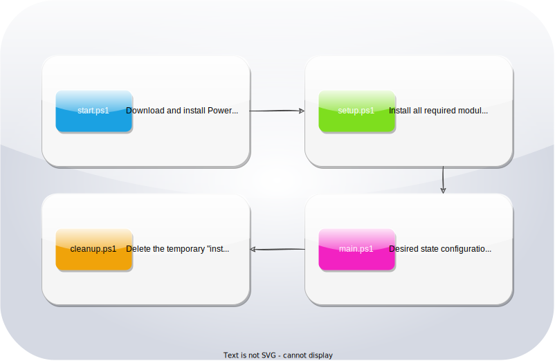

# Desired State Configuration Script for Windows 11

This project is a DSC script that configures Windows 11 in a more optimal way. It includes custom software installation, registry tweaks, IP configuration, and more.

Table of Contents:
1. [Set desired features](#1-set-desired-features)
    - [Hostname](#hostname)
    - [IPconfig](#ipconfig)
    - [Software](#software)
    - [RegistryTweaks](#registrytweaks)
    - [OptionalFeatures](#optionalfeatures)
2. [Running the script](#2-running-the-script)
3. [How it works](#3-how-it-works)

## 1. Set desired features

Inside the `dsc_script` directory, you'll find the `config.json` file. This is where the data of all features of the configuration are stored.

### Hostname

The `Hostname` key contains a string that your device will be named after once you've run the script. Change this value according to how you wish to name your device.

### IPconfig

The `IPconfig` object contains key and value pairs for the host's IPv4 address, the default gateway address and the DNS server's address. Change these values according to your needs.

### Software

The `Software` key contains an array of software package names that should be installed once the script is run. Add or remove entries as desired.

### RegistryTweaks

The `RegistryTweaks` key contains an array of registry tweak objects. Each object has a `Status` key with a `true` or `false` value. The tweak will only be installed if this value is set to true. The `Name` key contains an identification value. The `Path` key contains the registry path of the tweak. `Subkeyname` is how the subkey will be called in the registry. `Datatype` defines what kind of datatype the subkey's value is. `Data` contains the actual data of the subkey.

### OptionalFeatures

The `Features` key contains an array of Windows optional features that should be enabled by the script. Add or remove entries as desired.

## 2. Running the script

After a fresh new installation of Windows 11 on your device, the required execution policy hasn't been set yet to run the script. Without setting this, you are unable to run any external scripts.
Open `Windows PowerShell` and run the following command:

`Set-ExecutionPolicy -ExecutionPolicy RemoteSigned`

Once this has been done, you'll be able to run the `start.ps1` script to start the whole process. You'll find the `start.ps1` script inside the `script` folder. Doing this will begin the sequence of running all the necessary individual script files in a specific order.

## 3. How it works

The `start.ps1` script downloads and installs `PowerShell 7` and schedules a task to run the next script, `setup.ps1` with `PowerShell 7`. Then the `setup.ps1` installs all required modules required for the next script and schedules a task to automatically run the `main.ps1` script. The `main.ps1` script is where the actual DSC settings are created as .MOF files and then executed. For a flawless install of the Windows services, the `services.ps1` runs next. After the features are enabled, a scheduled task gets created to automatically run the `cleanup.ps1` script. This final script deletes the temporary default admin user, all the script & .MOF files, and creates a new user with user inputted credentials.

For a visual representation of the order in which the individual script files are executed and their overarching functionalities, take a look at `dsc_diagram.svg`.

## 4. Things might change

For example: Making registry settings work for newly created users is not as easy as we thought. What possibly need to change is treating the registry settings as a separate product, which is it's own script that has to be used manually for each new users created on the computer.